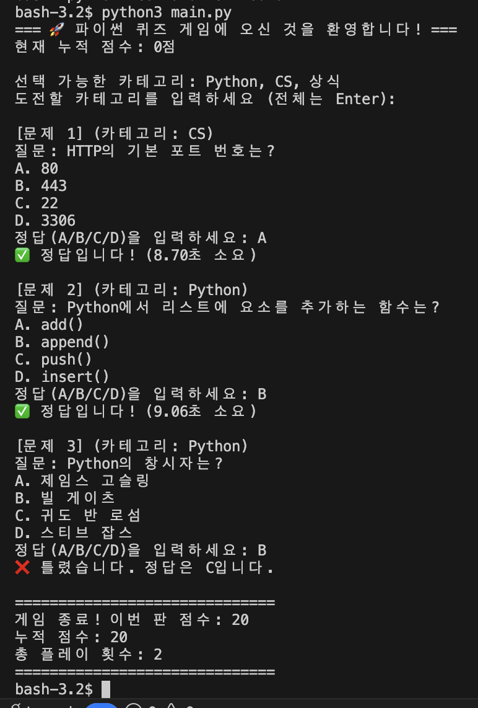
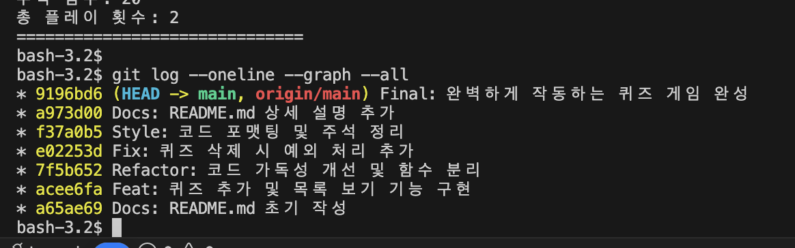
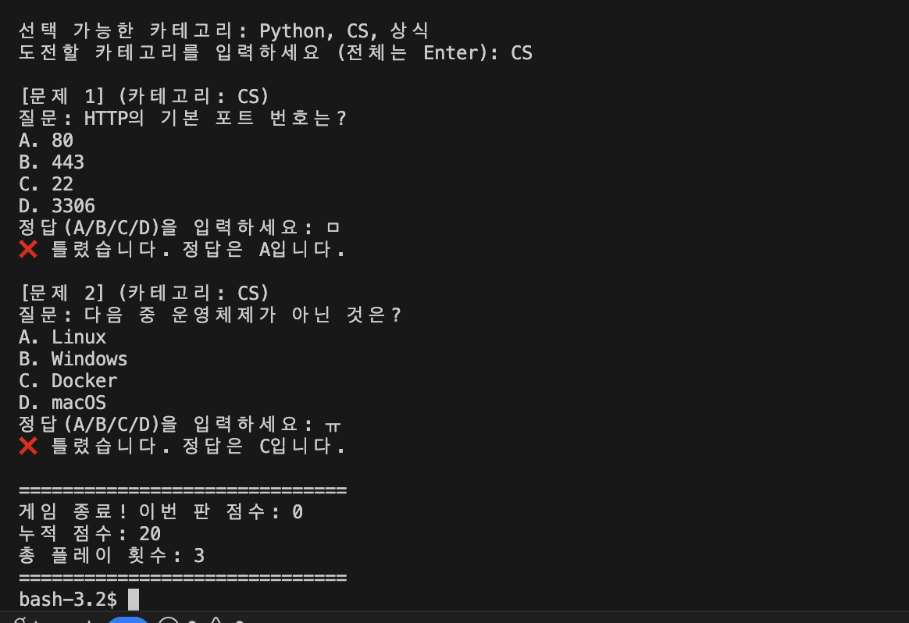

# Python Quiz Game Project

파이썬 기초 문법과 Git 협업 과정을 학습하기 위한 퀴즈 게임 프로젝트입니다.

## 1. 프로젝트 개요
- **개발 언어**: Python 3.10+
- **주요 기술**: OOP(객체지향), JSON 파일 입출력, Git/GitHub 버전 관리
- **저장소 주소**: [https://github.com/haeunyn/my-python-quiz](https://github.com/haeunyn/my-python-quiz)

## 2. 퀴즈 주제 선정 이유
- 파이썬 학습자들이 기초 문법을 재미있게 복습할 수 있도록 돕기 위해 '파이썬 기초'를 주제로 선정하였습니다. 
- 사용자가 직접 문제를 추가하고 관리하며 학습 효과를 극대화할 수 있는 인터랙티브한 도구를 목표로 했습니다.

## 3. 실행 방법
터미널에서 아래 명령어를 입력하여 게임을 실행합니다.
```bash
python main.py
```

## 4. 기능 목록
- **퀴즈 풀기**: 랜덤으로 추출된 문제를 풀고 힌트(감점)를 사용할 수 있습니다.
- **퀴즈 추가**: 새로운 질문, 보기, 정답, 카테고리를 시스템에 등록합니다.
- **퀴즈 목록**: 현재 저장된 모든 퀴즈의 정보를 확인합니다.
- **퀴즈 삭제**: 불필요한 문제를 번호로 선택하여 삭제합니다.
- **점수 및 히스토리**: 누적 점수와 과거 게임 기록(날짜, 점수)을 조회합니다.

## 5. 파일 구조
```text
.
├── main.py          # 게임 실행 및 전체 로직 클래스 포함
├── state.json       # 퀴즈 데이터 및 게임 히스토리 저장 파일
├── README.md        # 프로젝트 설명 문서
└── docs/            # 문서 및 스크린샷 저장 폴더
    └── screenshots/ # 실행 화면 캡처 이미지
```

## 6. 데이터 파일 설명 (state.json)
- **경로**: 프로젝트 루트 디렉토리 (`./state.json`)
- **역할**: 프로그램 종료 후에도 데이터가 유지되도록 저장하는 데이터베이스 역할
- **필드 구조**:
  - `quizzes`: 퀴즈 목록 (question, options, answer, category, hint 포함)
  - `history`: 게임 기록 (date, score, total_questions 포함)

## 7. 실행 화면 스크린샷

### 메인 메뉴 및 게임 실행


*프로그램 시작 시 나타나는 메인 메뉴와 퀴즈 풀이 시작 화면입니다.*

### 카테고리 선택 및 퀴즈 풀이


*카테고리별 퀴즈 선택 및 힌트 사용 기능을 포함한 실제 게임 진행 화면입니다.*

### Git 커밋 로그 (10개 이상 달성)


*기능 단위로 커밋을 진행하여 프로젝트의 히스토리를 관리한 로그입니다.*

## 8. 학습 포인트 및 느낀 점
- **객체지향 프로그래밍(OOP)**: `Quiz`와 `QuizGame` 클래스를 분리하여 데이터와 로직을 체계적으로 관리하는 방법을 익혔습니다.
- **데이터 영속성**: `json` 모듈을 활용하여 파일 읽기/쓰기를 구현함으로써, 프로그램이 종료되어도 데이터가 사라지지 않는 환경을 구축했습니다.
- **Git/GitHub 워크플로우**: `add`, `commit`, `push`, `pull`, `rebase` 등 실무에서 사용하는 핵심 Git 명령어들을 직접 사용하며 버전 관리의 중요성을 깨달았습니다.
- **예외 처리**: 사용자 입력값에 대한 유효성 검사를 통해 프로그램이 비정상 종료되지 않도록 견고하게 설계하는 연습을 했습니다.

## 9. 라이선스
이 프로젝트는 학습 목적으로 제작되었으며, 자유롭게 수정 및 배포가 가능합니다.


# Clone test updated
